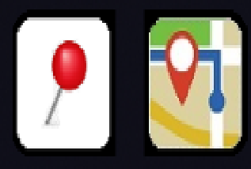

# GetMeBack
GetMeBack! allows you to mark a location and then easily get directions to return. This is useful for example if you park your car and go shopping and then forget where your car is. The app uses your phone's location services as well as Google Map's turn-by-turn directions to return to the marked location. Navigation modes are:
- Driving
- Walking

When the app is launched the first time, it will request location permission. *Precise location* mode **MUST** be selected for the app to function properly.

## General

###Getting location
Tap the pushpin icon  to get the current location. The location request will be processed in background. When the location is acquired, a separate background task will be started to get the address (located below the icons). The address will be updated automatically.

### Returning to the destination
Tap the map icon  to request Google turn-by-turn directions. A dialog will appear requesting the navigation method: either *driving* or *walking*.

NOTE:
- it may take some time to get the current location and navigation directions
- if the current location and destination are too close together, it may result in a Google navigation error

### Setting destination address
Long-press on the map to get the location. The address will be acquired from the location

## Tips and Suggestions
Tapping on the main screen will prompt to set that as the new destination. It will display the geolocation and the street address. Tap OK to set as the new destination or Cancel.

When dealing with Android's location service, getting the current location or the address from the location can take some time. You may notice a delay in acquisition until the operation is complete.

### Home screen widget
A Home screen widget can be created to quickly set the current location and return to the destination. Steps:
- long-press on the Home screen
- select *Widgets*
- tap *GetMeBack*
- press and hold the widget preview icon 
- drag the widget to the Home screen
